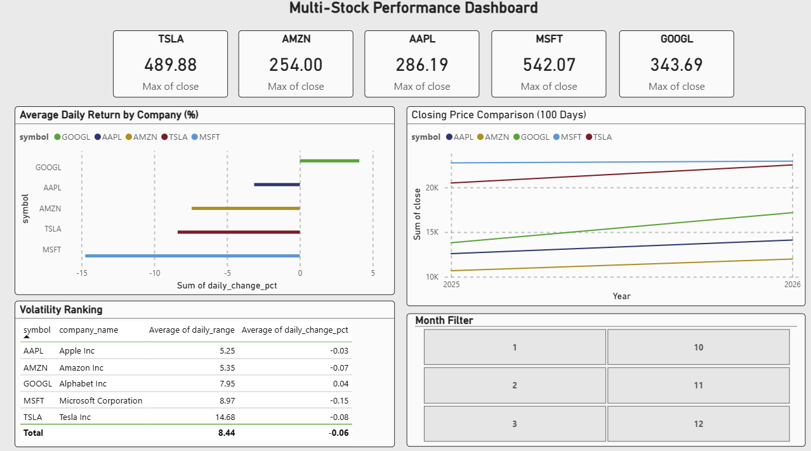

# Multi-Stock Data Warehouse & Power BI Dashboard
**Author: Mohammad Kabir Sheikh**

An automated ETL pipeline that extracts live stock market data for 5 major companies,
builds a star-schema data warehouse in SQLite, and powers an interactive Power BI
dashboard for cross-company performance analysis.

---

## Pipeline Architecture

```
Alpha Vantage API (5 companies)
        |
        | (JSON via HTTP — auto-throttled)
        v
project2_pipeline.py
        |
        |-- EXTRACT  : Fetch + save raw JSON per company
        |-- TRANSFORM: Clean, enrich, build dimension tables
        |-- LOAD     : Star-schema warehouse in SQLite
        |
        v
warehouse.db  (3 tables: dim_company, dim_date, fact_stock_prices)
        |
        v
powerbi_exports/flat_view.csv
        |
        v
Power BI Dashboard
```

---

## Warehouse Design — Star Schema

```
dim_company          fact_stock_prices          dim_date
-----------          -----------------          --------
symbol_id (PK) <---- symbol_id (FK)    ----> date_id (PK)
symbol               date_id (FK)             full_date
company_name         open                     year
sector               high                     month
                     low                      quarter
                     close                    day_of_week
                     volume                   is_month_end
                     daily_change
                     daily_change_pct
                     daily_range
```

The star schema separates descriptive data (dimensions) from measurable
data (facts) — the standard pattern used in production data warehouses.

---

## Companies Tracked

| Symbol | Company | Sector |
|---|---|---|
| TSLA | Tesla Inc | Consumer Discretionary |
| AAPL | Apple Inc | Technology |
| MSFT | Microsoft Corporation | Technology |
| GOOGL | Alphabet Inc | Communication Services |
| AMZN | Amazon Inc | Consumer Discretionary |

---

## What the Pipeline Does

### Extract
- Calls Alpha Vantage REST API for each company
- Fetches 100 days of OHLCV data (Open, High, Low, Close, Volume)
- Auto-throttles API calls (12s delay) to respect free tier rate limits
- Saves raw JSON per company before any transformation

### Transform
- Parses nested JSON into structured Pandas DataFrames
- Cleans and standardizes column names
- Fixes data types (string → float for prices, string → int for volume)
- Enriches data with: `daily_change`, `daily_change_pct`, `daily_range`
- Builds `dim_company` and `dim_date` dimension tables
- Builds `fact_stock_prices` fact table with foreign key references

### Load
- Loads all 3 tables into a SQLite data warehouse
- Runs 5 analytical SQL queries across joined tables
- Exports CSVs for Power BI consumption

---

## Analytical SQL Queries

| Query | What it answers |
|---|---|
| Latest close per company | Current snapshot of all 5 stocks |
| Average monthly return | Which company performed best each month |
| Volatility ranking | Which company has the biggest daily swings |
| Best single trading day | Peak gain day per company |
| Sector performance | Technology vs Consumer Discretionary comparison |

---

## Power BI Dashboard

Built on `flat_view.csv` — a pre-joined export combining all 3 warehouse tables.

**4 visuals:**
- Line chart — closing price over time for all 5 companies
- Bar chart — average daily return per company with month slicer
- KPI cards — latest closing price per company
- Volatility table — companies ranked by average daily price range


---

## Tech Stack

| Tool | Purpose |
|---|---|
| Python 3 | Core pipeline language |
| `requests` | REST API calls with error handling |
| `pandas` | Data transformation and warehouse table construction |
| `sqlite3` | Star-schema data warehouse (built into Python) |
| Power BI Desktop | Interactive dashboard and data visualization |
| Alpha Vantage API | Free financial market data source |

---

## How to Run

### 1. Install dependencies
```bash
pip install requests pandas
```

### 2. Get a free API key
Sign up at https://www.alphavantage.co/support/#api-key (free, instant)

### 3. Add your API key
Open `project2_pipeline.py` and set:
```python
API_KEY = "your_api_key_here"
```

### 4. Run the pipeline
```bash
python project2_pipeline.py
```

The pipeline takes ~1 minute to run due to API rate limiting between calls.

### 5. Open Power BI
Import `powerbi_exports/flat_view.csv` and build your visuals.

---

## Output Files

```
multi-stock-warehouse/
├── project2_pipeline.py          # Full ETL pipeline
├── warehouse.db                  # SQLite star-schema warehouse
├── raw_data/                     # Raw JSON per company
│   ├── TSLA_raw.json
│   ├── AAPL_raw.json
│   ├── MSFT_raw.json
│   ├── GOOGL_raw.json
│   └── AMZN_raw.json
├── powerbi_exports/
│   ├── dim_company.csv
│   ├── dim_date.csv
│   ├── fact_stock_prices.csv
│   └── flat_view.csv             # Import this into Power BI
├── dashboard_screenshot.png      # Power BI dashboard
└── README.md
```

---

## Key Concepts Demonstrated

- Automated multi-source ETL pipeline design
- Star-schema data warehouse modeling (fact + dimension tables)
- Foreign key relationships and SQL JOIN queries
- API rate limit handling with automatic retry
- Cross-company financial data analysis
- Power BI dashboard connected to a structured data warehouse

---

## Related Project

[Financial Data ETL Pipeline](https://github.com/GeekyKabir/financial-etl-pipeline) — Project 1: single-stock ETL pipeline that this project extends.


---

## Author

**Mohammad Kabir Sheikh**
Data Engineering | Python | SQL | Power BI | Cloud
[LinkedIn](https://www.linkedin.com/in/mohammad-kabir-sheikh/)
